# 帧同步网络库设计与实现


# 1 绪论

## 1.1 项目背景意义

### 1.1.1 项目背景

近些年来，游戏行业迅速发展，在移动端更是如此。根据市场研究公司Newzoo最新发布的《2018全球游戏市场报告》，2018年全球游戏产业收入将达到1379亿美元，其中的703亿美元来自移动端平台，占比超过一半，同时2018年也将是移动游戏收入在全球游戏总收入中占比超过一半的第一个年头。游戏在创造乐趣的同时，更成为了至关重要的经济产业。

游戏产业预计每年的收入将保持两位数的增长速度，到2021年的复合增长率将为10.3%，届时收入将达到1801亿美元。值得关注的是，在2012年到2021年这十年的时间里，移动游戏从最开始占比最小的部分增长到了2021年千亿美元的规模，在未来几年间，移动游戏的增长速度将超过整个游戏产业。

以当下最火的MOBA（多人在线竞技）手游王者荣耀为例，数据显示，王者荣耀最高DAU（日活跃用户）突破8000万，月流水过30亿，渗透率达到22.3%，甚至一款皮肤的日流水就能达到1.5亿。这款游戏成功的背后有许多值得学习和探索的地方，抛开其策划设计层面，在技术角度上，王者荣耀可以在移动网络下依然保持流畅的游戏体验，其采用的游戏同步方案就是帧同步技术。

### 1.1.2 帧同步技术简介

游戏中常见的同步方案有状态同步和帧同步两种。

在状态同步中，客户端发送角色的数据和状态到服务器，在服务器端计算游戏行为的结果，然后以广播的方式将计算出的结果发送到各个客户端，客户端则根据收到的数据显示和渲染相应的内容。绝大多数MMO（大型多人在线）手游、回合制游戏都是采用这种同步方式。

在帧同步模式下，客户端发送用户每帧的动作到服务端，服务端则并不计算游戏的结果，而是将所有用户的动作转发给各个客户端，客户端则根据收到的所有的游戏动作来进行运算，并将结果渲染和显示出来。MOBA类手游、竞技类端游等实时性要求较高的游戏大多采用这种同步方式。

帧同步模式的特点可以概括为：① 低流量：帧同步只是转发玩家的行为，而不是整个游戏的状态和数据，所以要广播的数据量相比于状态同步要小很多。② 高一致性：客户端需要不断将其行为上报到服务器，并且等待服务器下发的帧数据驱动其逻辑，相同的数据输入保证了客户端之间一致性。③ 高实时性：同步频率精确到每帧，确保了数据的实时性。

### 1.1.3 本项目研究的意义和目的

一般帧同步游戏中，同步的频率一般在每秒30帧及以上，所以对网络库的实时性要求较高。并且帧同步模式每帧同步用户的操作，而不是游戏的状态，所以需要同步的数据量较小，即占用带宽较小，主要应用在移动端的环境下。而移动端的网络环境（Wifi和4g网络）不稳定，网络包延时的波动较大，并且丢包的概率会更高[1]。

TCP等可靠传输协议，虽然保证了数据的可靠性，但是其网络丢包的重传机制主要基于网络公平性，总流量较少设计的，并且其RTO机制在发生丢包的情况下需要较长的时间恢复。而且TCP底层实现过于复杂，并无有效参数来直接设置RTT或者RTO的超时性，对于减少丢包后的恢复时间，基本无法调控，即无法保证数据传输的实时性。所以一般游戏网络库通常会将UDP封装成可靠协议，并优先保证的是数据的实时性而不是流量的公平性。

虽然现在已经有一些成熟开源的网络库，例如ENet和实时性较高的传输算法协议，例如KCP。但是ENet虽然可以关闭流量控制，但是由于其重传机制，在发生丢包时仍需要较长时间恢复。而KCP只是一种算法协议，不是成熟的网络库。

数据传输的实时性对于网络游戏尤其是帧同步游戏至关重要，极大程度上影响着游戏体验。选择合适的网络库对于游戏的服务端是最为基础也是最为重要的一步。如何设计网络协议及数据包发送和重传方式，使得网络库在弱网环境下仍可以取得稳定的延时和较高的实时性，是本项目研究的重点。

## 1.2 项目内容

帧同步游戏需要同步的数据量较小，通常服务器需要广播的数据通常只有几十个字节，而IP协议支持的最小的MTU也有576字节，所以在发送本次数据时完全可以携带数个之前已经发送的帧，通过牺牲带宽的方法减少丢包和延时波动带来的影响，以换取数据传输的实时性。

故本项目实现了一个针对帧同步游戏的网络库，该网络库不仅实现了基于ARQ（自动重传请求）协议的可靠数据的发送，而且实现了基于冗余协议的数据传输方式，即在下次数据包发送时会捎带之前尚未收到确认的数据包，通过牺牲带宽的方式减少延时和丢包对数据实时性的影响。网络库可以选择打开或关闭流量控制，并通过冗余协议的发送，在弱网环境下仍取得较为稳定的延时和较高的实时性。网络库支持windows、linux等多种操作系统。

并且本项目测试和比较了该网络库与现有网络库和网络协议（KCP，ENet等）在不同网络环境下的传输延时和实时性，得出在不同网络环境下网络库选择的最优的解决方案，以解决实际问题的需求。

网络库底层调用UDP套接字实现，包含功能如下：

1. 连接管理： 网络库实现了主动连接，主动或被动断开连接的过程。主动连接时需要进行类似于TCP的三次握手的过程，主动断开连接则需要进行两次挥手过程。网络库同时具有心跳机制，如果检测到已经连接的对端在一定时间内没有响应，则认为其已经断开连接，并进入断开连接的逻辑。
2. 可靠数据包的传输：网络库实现了基于ARQ（自动重传请求）协议的可靠数据包的传输，即实现了接收确认和超时重传的功能。网络库在收到对端数据时会发送接收确认指令（ACK），如果在该数据指令超时重传（RTO）的时间内没有收到对端的接收确认，则对该数据进行重传，直到收到对端的ACK为止。
3. 基于冗余协议的数据包传输：网络库封装了冗余协议数据包的传输，即在发送本次数据包时会捎带已经向对端发送但是没有收到ACK的数据包，直到收到对端的ACK为止。冗余协议同样具有超时重传的功能，以应对发送频率低于网络平均延时的情况。
4. 数据包排序：对于用户传输的数据，网络库会根据用户的发送顺序对其进行排序，并在接收时保证数据包接收的顺序。如果在接收数据包时，高序号的包已经到达，而低序号的包未到达，则会推迟高序号数据包的处理，直到其之前的所有数据包均已到达。
5. 数据包分片和重组：为了避免IP分片，网络库在发送数据时如果检测到需要发送的数据长度超过了MTU，则会将当前数据拆分为多个数据包发送，并在接收端对拆分的数据进行重组。
6. 流量控制：网络库可以选择打开或者关闭流量控制。如果打开流量控制，网络库会保证发送和接收数据的速率不会超过HOST设置的上行和下载的带宽，并且在多个对端连接时，网络库会对HOST的带宽进行合理的分配，保证发送和接收速率不超过HOST带宽的前提下充分利用HOST的带宽。
7. 支持多系统：对底层UDP socket接口的调用会根据当前操作系统进行选择，以便在多系统上运行，目前支持的操作系统有windows和linux。

本文作者的主要工作在网络协议的制定与实现（包括可靠传输和冗余传输协议等），数据包的传输与确认，数据包的排序、分片和重组，流量控制算法的实现，连接管理等工作。以及分析并对比该网络库与现有网络库和网络协议在不同网络环境下的性能，总结出在不同网络状况下的最优的解决方案。

## 1.3 本文结构

项目接下来的内容将分为四个部分进行阐述：

1. 第一部分（第二章）：介绍了整个网络库的架构以及其数据处理流程框架。
2. 第二部分（第三~五章）：这一部分主要介绍网络库各个关键机制的设计以及实现方法，会详细介绍网络库连接管理流程，指令的设计格式，收发数据包的过程，协议算法的实现，以及流量控制算法的实现。该部分内容将分为以下三个章节进行讲解：
   1. （第三章）介绍了网路库中维护的各个连接的状态，以及连接建立的三次握手过程和断开连接的流程。
   2. （第四章）介绍了网络库发送数据时协议头的制定，以及数据指令格式的设计，数据包分片和重组的过程，以及基于AQR可靠协议的数据指令传输流程、冗余协议数据指令的传输流程和无序数据指令传输流程等。
   3. （第五章）介绍了网络库流量控制算法的实现。
3. 第三部分（第六章）该章节项目的测试成果展示，对比了该网络库冗余协议、基于ARQ的可靠传输协议与ENet和KCP等网络库在不同网络环境和丢包率下的性能，总结得出不同网络环境下最优的选择。
4. 第四部分（第七章）本章对该项目进行了总结，并对该项目的拓展性和拓展方向进行了探讨，并提出了针对其优化的可行性方案。

# 2 帧同步游戏网络库架构概述

## 2.1 帧同步游戏网络库架构

网络库由C语言实现，数据的发送和接收底层接口通过封装UDP socket系统调用实现。网络库由单线程实现，其主函数位于循环中，当有事件（连接事件，断开连接事件或者接收数据）产生时会向用户返回该事件。如果在用户设置的等待时间内无事件产生并且无数据接收，则会阻塞在select函数上，直到UDP缓冲区中有数据待处理或者超过用户设置的等待时间。

### 2.1.1 网络库数据处理流程

网络库的数据处理流程如图所示。

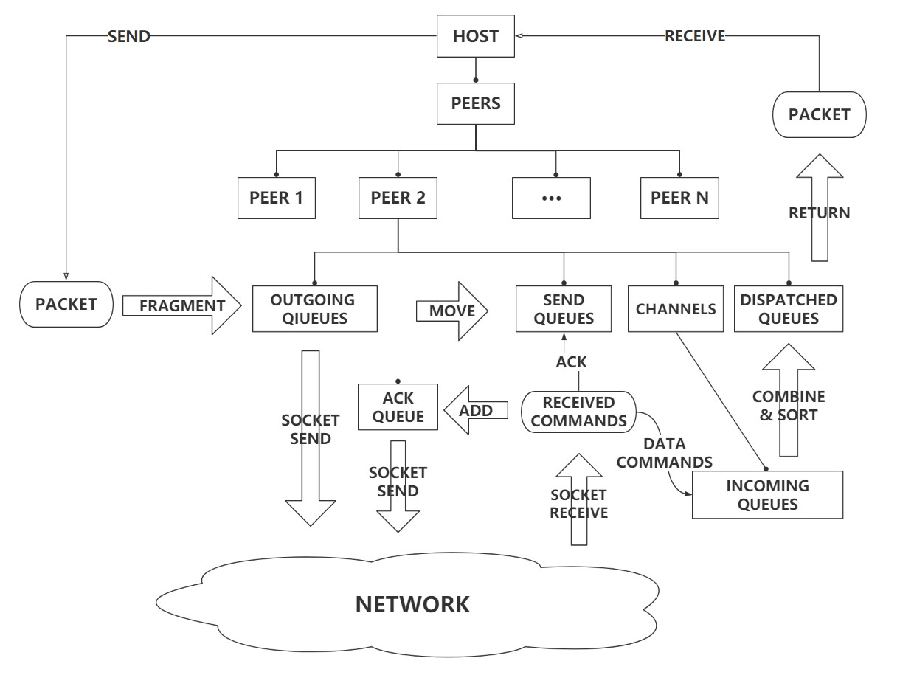

在创建网络库时，会创建一个HOST结构变量用于储存网路库信息。在HOST结构变量中有一个PEERS数组，其中每个PEER结构变量负责同外部主机进行通信，向外部主机发送数据以及处理接收的数据等。PEER会在断开连接时进行初始化，当发起主动连接或者有外部连接到来时，将空闲的PEER分配给新的连接。在创建HOST时会对PEER数组的大小进行设定，即可以支持最大的连接数。网络库实现的是多对多的连接，其中每个PEER便是与一个外部主机进行通讯的连接。

在PEER结构中，有一些队列用于缓存发送和接收的指令。当用户需要发送数据时，首先会根据需要发送数据和MTU大小的比较来判断是否需要分片，如果数据长度大于MTU，则会将该数据包拆分为多个数据指令进行发送。需要发送的数据会首先压入PEER中的outgoing队列中，outgoing队列用于缓存需要发送但是还没有调用socket接口发送的指令。在调用socket发送接口将数据发送出后，会将outgoing队列中的数据转移到sent队列中，并对该指令设置相应的重传时间，因为不确定对端是否收到数据。在下次超时检测中，如果sent队列中有可靠指令已经超过重传时间，则会将其重新压入outgoing队列的头部重传。

网路库将UDP socket设置为非阻塞模式，每次循环中会尝试从UDP缓冲区中获取数据，如果收到数据则对其进行处理，否则跳出接收数据流程。

如果接收到的是ACK指令（接收确认指令），网络库会将sent队列中对应的指令删除，意味着对端已经收到相应指令。

如果接收到的指令是可靠指令，则会创建一个ACK指令并将其压入ACK队列中，在下次发送数据时，将其发送给对端。如果该可靠指令是网络库系统指令，例如连接、断开连接、PING指令等，则分别对其进行对应的处理。如果该可靠指令是数据指令，则将其压入incoming队列中并排序和重组（如果之前对其进行了分片操作）。incoming队列位于Channel结构中，因为网络库支持多种数据包类型的发送，每种类型数据会有自己独立的Channel对数据进行接收和重组，不同Channel之间互不影响。

incoming队列中已经排序重组好的数据指令会压入dispatched队列中，dispatched队列即该PEER中待处理的数据队列，在下次调用网络库主函数时，会向用户返回一个数据接收事件，并将收到的数据携带在事件中返回给用户。

### 2.1.2 网络库主循环

网络库由单线程实现，由于对各个队列的操作并不是原子性的，所以并不支持多线程调用。网络库的主要监听和处理流程在mrtp_host_service函数中，其主要流程如图所示：

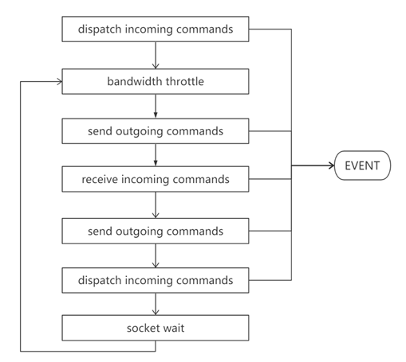

在调用mrtp_host_service函数时，首先会检测是否已经存在待处理的事件，该过程在dispatch_incoming_commands函数中进行。网络库在产生事件时，会将产生事件的PEER指针压入HOST的dispatch队列中，在每次调用dispatch_incoming_commands函数时会检测HOST的dispatch队列中是否有相应PEER待处理，如果存在，则根据PEER的状态向用户返回相应事件：

1. PEER状态为connected succeed：则表明当前PEER是连接事件，有新的PEER与HOST连接，返回CONNECT事件。

2. PEER状态为zombie：表明当前PEER是断开连接事件，该PEER已经断开连接，返回DISCONNECT事件。

3. PEER状态为connected：表明收到该PEER向host传输的数据，返回RECEIVE事件，并在该事件中携带接收到的数据。

如果HOST中无事件待处理，则进入主循环。首先对调用bandwidth_throttle函数对host及于其相连的PEER进行流量控制，具体过程在下一节介绍。

接下来调用send_outgoing_commands函数，该函数会将outgoing队列中的指令调用socket接口发送给相应的PEER，指令发送之后会将数据从outgoing队列转移到sent队列中。在该函数中，网络库会对sent队列中的指令进行超时检测，如果sent队列中存在指令重传次数达到上限，或者其RTO达到上限，则意味着该PEER已经断开连接，则立即返回DISCONNCT（断开连接）事件。

在receive_incoming_commands函数中会调用socket接收接口从UDP缓冲区获取数据并处理，如果在接收过程中有连接事件产生，则直接返回CONNECT事件，否则继续接收数据直到UDP缓冲区中没有数据待处理或者达到单次接收数据次数上限。接收到的数据会保存在imcoming队列中，并在每次将数据指令压入imcoming队列时都尝试将数据转移到dispatched队列中，如果PEER的dispatched队列中有数据待处理，则将PEER压入到host的dispatch队列中，在下一次调用dispatch_incoming_commands对其进行处理并返回RECEIVE事件。

​       接下来再次调用send_outgoing_commands函数将接收数据后产生的ACK指令发送出去。网络库立即返回ACK指令而不是像TCP那样延时捎带发送，虽然会浪费少部分带宽，但增强了接收确认操作的实时性。

​       接下来再次调用dispatch_incoming_commands函数，将接收数据后产生的RECEIVE事件返回给用户。

​       如果在进行上述操作后均无事件产生，则会调用socket_wait函数，其内部调用select函数（IO复用）实现，会根据用户设置的超时事件阻塞在UDP缓冲区的读操作上，直到UDP缓冲区中有数据待处理或者到达用户设置的超时时间。采用这种方式代替忙等可以有效减少网络库对CPU的占用。

​       本文作者主要负责协议的制定，数据包的发送、接收和处理流程（包括可靠数据包、冗余协议数据包和非可靠数据包），连接的建立以及主动被动断开连接和流量控制的实现，即主要负责收发数据等协议层面的内容。

## 2.2 关键技术分析

### 2.2.1 心跳机制

网络库为实时获取每个PEER的连接状态，检测每个PEER是否已经断开连接及时释放资源，添加了心跳机制。

网络库内部储存了上次从该PEER接收数据的时间戳，在每次发送数据时，如果检测到超过相应的时间间隔没有收到对端的数据并且网络库中没有需要向对端发送的指令，则会向对端发送一个PING指令，这个PING指令只包含了网络库指令协议头，并要求对端发送ACK指令。该指令会进行正常的超时重传逻辑，如果重传次数超过一定的限制或者其RTO超过一定的限制，则认为该PEER已经断开连接，则进入断开连接流程

### 2.2.2 Session机制

网络库为了防止来自某个连接的老的重复的分组在该连接已经终止后重现，造成不可预测的后果，在连接建立时为每个PEER设置了一个当前连接的Session ID（会话号），用于标记当前的连接。在每次向对端发送UDP数据报时，会将该Session ID携带在UDP数据报的头部，即携带在网络库协议头的头部。对端在接收数据时，首先会匹配收到数据的Session ID，如果检测到Session ID不匹配，则直接将该数据丢弃。

### 2.2.3 选择重传机制

网络库基于ARQ协议可靠数据包的传输和冗余协议数据包的传输都采用的选择重传的方法，即当检测到相应指令超时或者丢失的话，就向对端重传相应的指令。每当对端收到指令时，会返回一个ACK指令。当发送端收到ACK指令时，则将相应的缓存队列中的指令删除，表明对方已经收到。

​       选择重传只是重传丢失的指令，可以在网络情况较差，丢包率较高或延时波动较大的情况下节省更多的带宽并取得更高的效率，但是会占用发送端更多的内存来缓存已经发送的指令。

# 3 帧同步游戏网络库状态管理

## 3.1 网络库客户端状态

网络库客户端共有10种状态：

1. disconnected：PEER断开连接的状态，即可以将该PEER分配给新的连接用于通信。

2. connecting：主动连接方向对方发送CONENCT指令后的状态，即主动连接方第一次握手后的状态。

3. acknowledging connect: 被动连接方收到CONNECT指令后的状态，即被动连接方第二次握手后的状态。

4. connection succeed：主动连接方收到对端返回的VERIFY CONNECT命令后的状态，即表明已经成功连接，准备向用户返回连接成功事件。

5. connection pending：被动连接方收到对方返回的ACK后的状态，即被动连接方第三次握手后的状态，表明连接已经建立完成，准备向用户返回连接成功事件。

6. connected：用户已经处理连接成功事件后的状态，此时连接已经正式建立完成，双方可以发送数据进行通信。

7. disconnect later：位于该状态的客户端将当前缓存队列中数据发送完成后就进入断开连接的过程。

8. disconnecting：主动断开连接方向对端发送DISCONNECT指令后的状态。

9. acknowledge disconnect：被动断开连接方向对端返回ACK指令前的状态

10. zombie：断开连接过程已经完成，准备向用户返回断开连接事件的状态。

## 3.2 连接流程建立

网络库连接建立流程如图3.1所示，HOST1向HOST0主动发起连接：

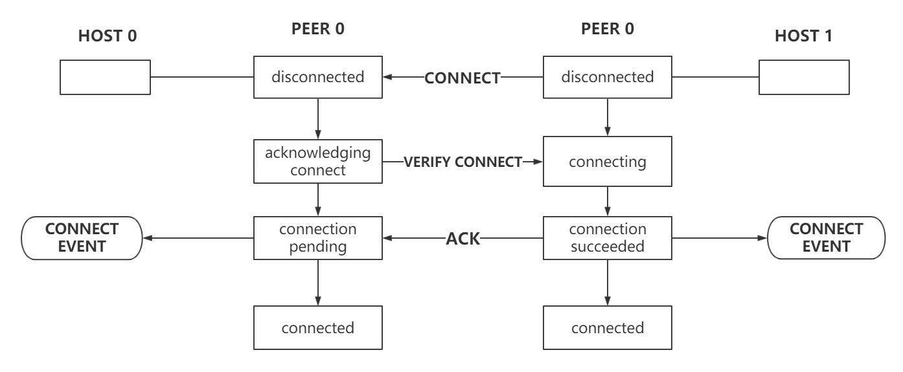

网络库连接建立采用三次握手的过程[3]：

1. 客户端向服务器发送CONNECT指令，并将PEER的状态从disconnected变为connecting。

2. 服务器收到CONNECT指令后，将对应PEER的状态从disconnected变为acknowledging connect，并向客户端返回VERIFY CONNECT指令。

3. 客户端收到VERIFY CONNECT指令后，将其状态从connecting变为connection succeeded，向服务器返回ACK指令，并准备向用户返回连接建立事件。当用户接收连接建立事件后，将其状态从connection succeeded变为connected，此时连接建立完成。

4. 服务器收到ACK指令后，将其状态从acknowledging connect变为connection pending，并准备向用户返回连接建立事件。当用户接收连接建立事件后，将其状态从connection pending变为connected，此时连接建立完成。

由于网络库是单线程实现，并且需要向用户返回连接建立成功的事件，所以在连接建立完毕后，不是直接将客户端的状态变为connected，而是将其状态先变为connection succeeded和connection pending，等待用户接收和处理断开连接事件后，再将其状态变为connected。

在三次握手的过程中，建立连接的双方还会同步相关数据：

1. PEER ID：用于后续发送数据包时标识相应的PEER。

2. session ID：session机制中用于标记当前连接的会话号，用于判断每次接收到的数据是否属于本次连接内发送的数据。

3. MTU：用于同步双方判断是否需要分片的数据长度。

4. window size：用于设置对端的发送窗口的大小。

5. incoming bandwidth：本地下载数据的带宽，如果设置为0，则表明不做带宽控制。

6. outgoing bandwidth：本地上传数据的带宽，如果设置为0，则表明不做带宽控制。

7. connect ID: 用于标识本次连接的ID，如果判断是否为重复的连接。

需要同步的数据分别携带在CONNECT指令和VERIFY CONNECT指令中，其中connect ID用于防止CONNET指令已经发送到对端而服务器返回的VERIFY CONNECT指令却丢失的情况，这时客户端会重传CONNECT指令，connect ID便用来判断该指令是重传的指令还是新的连接请求。如果该值与HOST的PEERS数组中状态为connecting的PEER的connect ID相同，则为重传的连接指令，则将该指令直接丢弃，否则为新的连接指令，进行正常的连接建立流程。

## 3.3 断开流程处理

网络库端来连接流程如图所示，其中HOST1向HOST0主动断开连接：

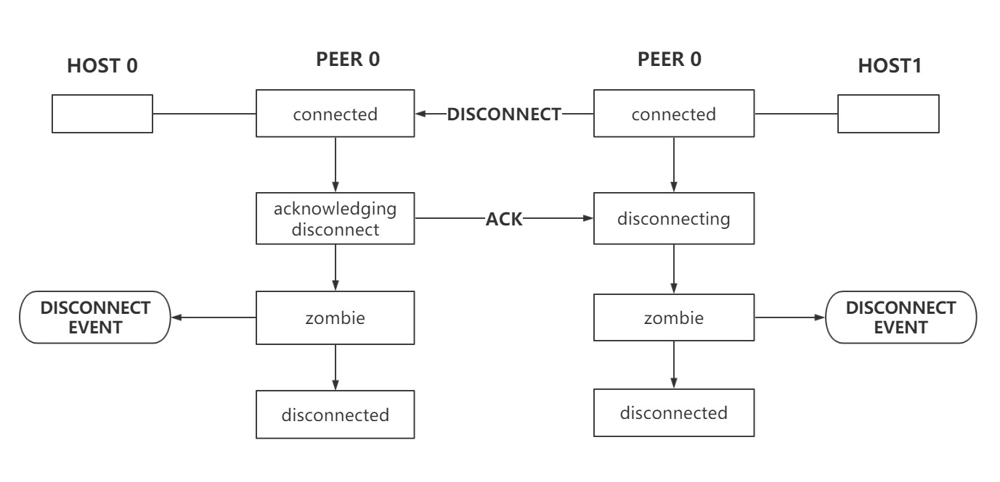

断开连接流程采用两次挥手的流程：

1. 客户端向服务器发送DISCONNECT指令，并将其状态从connected变为disconnecting。

2. 服务器收到DISCONNECT指令后将其状态从connected变为acknowledging disconnect，并返回ACK指令。当服务器发送ACK指令后，将其状态变为zombie，并准备向用户返回断开连接事件。当用户接收断开连接事件后，将PEER状态从zombie变为disconnected。

3. 客户端收到ACK指令后，将其状态从disconnecting变为zombie，并准备向用户返回断开连接事件。当用户收到断开连接事件后，将PEER状态从zombie变为disconnected。

先将PEER状态变为zombie而不是直接变为disconnected的原因是由于网络库是单线程的，需要向用户返回PEER连接事件，在zombie状态下的PEER当新的连接建立或者到来时，不会将其分配给新的连接，确保用户在处理端来连接事件后，PEER的状态变为disconnected，这是PEER才可以分配给新的连接用于通信。

服务器端的状态先变为acknowledging disconnect而不是直接变为zombie的原因是，处于zombie和disconnected状态的客户端不会发送和接收数据，但是服务器端需要返回ACK指令给客户端，所以在服务器返回ACK指令之后，才将其状态变为zombie。

## 3.4 超时流程

如果一个需要对端返回ACK可靠指令超时，网络库会将该指令的RTO（超时重传时间）变为之前的1.5倍，并重传该指令。如果检测到发送队列中的指令重传次数超过上限或者该指令RTO超过上限，则认为该PEER已经断开连接，则将该PEER的状态变为zombie，清空PEER数据，并准备向用户返回断开连接事件。

# 4 数据包传输机制

## 4.1 网络库协议头制定

网络库每次调用socket发送UDP数据报时首先会在UDP数据报的头部填充一个协议头用于标识当前数据报内携带的各个指令的源PEER ID以及数据的发送时间。在协议头后会填充一个或多个协议指令，每个协议指令都会包含一个指令头，用于标识该指令的类型和该指令的序号。根据指令的类型，不同的协议指令又会包含不同的数据，例如传输数据的协议指令需要包含传输数据的长度以及相应的数据，连接指令需要包含双方需要同步的数据等。

网络库发送的UDP数据包结构如图所示：

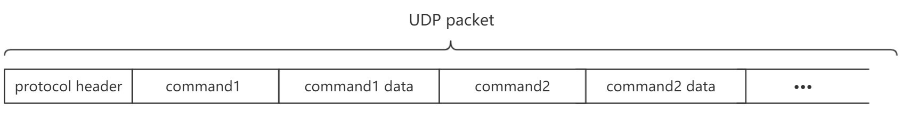

### 4.1.1 协议头（protocol header）制定

协议头是网络库每次发送UDP数据包是整个数据包的头部，每次发送单个UDP数据报是会填充在数据报的最前面，用于标记发送该数据的PEER ID和发送的时间。其结构如图所示：

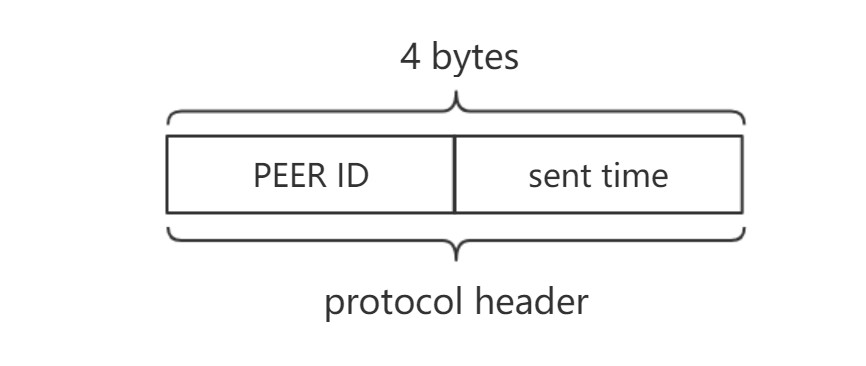

网络库支持的是多对多的连接，所以需要PEER
ID来标识当前发送数据的PEER。sent time用来填充返回的ACK指令的发送时间，ACK指令的发送时间用来计算其对应协议指令的RTT（往返时间）。由于当前UDP数据报内的携带的所有协议指令的发送时间都相同，所以将sent time放在协议头中而不是指令头中。

### 4.2.2 指令头（command header）制定
网络库中有多种不同类型的指令，其中每个协议指令都会携带一个4个字节的指令头，用于标记该指令的类型（command），指令的特性（flag）以及该指令的序号（sequence number）[4]。在每个指令中，除去指令头外，不同的协议指令还会携带不同的数据，所以网络库每种指令的大小其实是不固定的。协议头的结构如图所示：

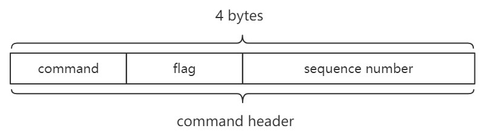

其中command用于标识当前协议指令类型的序号，根据协议类型即可获得协议指令的长度（协议类型和协议指令长度一一对应），flag用于标记该指令的特性，例如是否需要重传，是否需要排序等。sequence number用于标记该指令的序号，用于接收端对指令的排序以及用于选择重传机制的序号标识。

为了减少指令头的大小，sequence number只有2个字节，即只有16位，最大值只有65535。这个值很容易越界，所以接收端在对收到的序号进行排序时，需要考虑当指令序号越界后从0开始的情况，而不是简单的根据大小判断。

## 4.2 网络库数据传输指令结构

网络库在发送数据时，首先会判断需要发送的数据长度是否超过PEER的MTU的大小，如果超过，则需要首先将数据拆储存到多个数据指令中发送，并在接收端进行重组，如果不需要拆分，则可以放到单个数据指令中发送。由于拆分数据时，需要携带额外的数据，以便在接收数据端进行重组，而单个的数据指令除包含指令头外只需要额外携带一个指令长度数据，故单个的数据指令和需要分片的数据指令采用两种指令结构，以减少发送单个数据指令时的指令长度。

### 4.2.1 单个数据指令结构

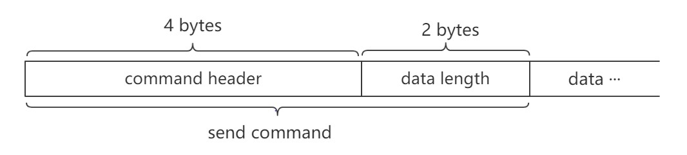

单个的数据指令结构如图4.4所示，该指令只需在指令头部后添加一个data length数据来记录其需要发送的数据长度。在发送数据时，会将数据添加在该指令后面。接收端通过检测指令头中的指令序号为数据指令，便会读取data length数据，进而通过data length的大小获取其后携带的数据。

### 4.2.2 分片数据指令结构

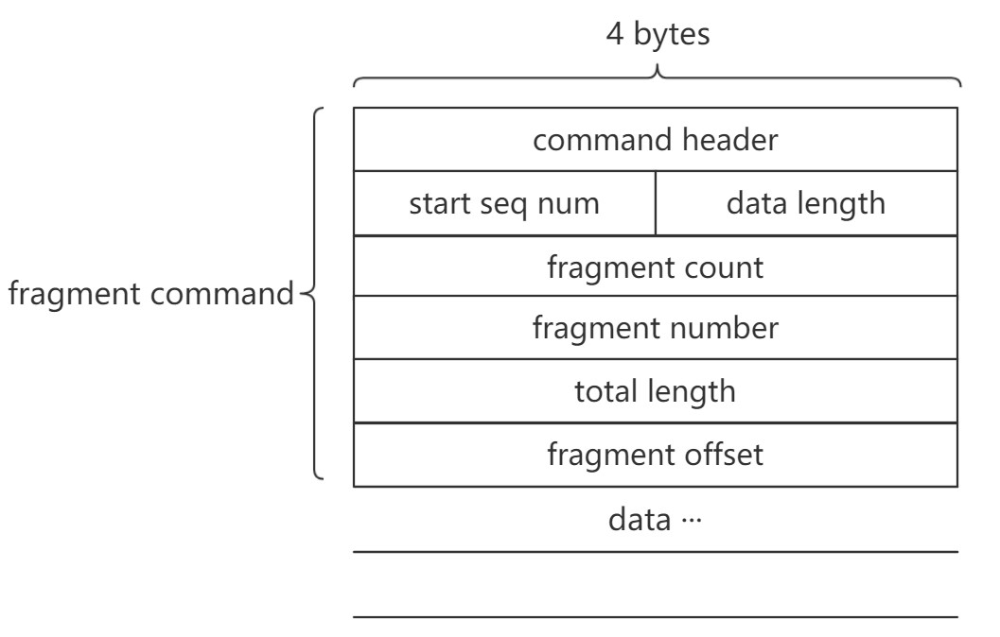

需要分片的可靠数据指令结构如图4.5所示。需要分片的可靠数据指令需要携带4个字节的协议头和2个字节的data length数据外，还需要携带该分片组的起始指令的序号（start seq num），该分片组中分片的个数（fragment count），该分片所在分片组中的序号（fragment number），分片前数据的总长度（total length），该分片携带数据在所有数据中的偏移量（fragment offset）等。

在接收端进行重组时，会首先检测该分片组的起始指令序号是否已经到达接收队列，如果没有到达，则创建一个新的数据指令根据起始指令序号插入到接收队列中的相应位置，并根据fragment offset和total length将收到的数据填充到该指令携带的数据包中，随后采用位图的方式根据fragment number来收取剩余的数据包以及防止对数据包进行重复的操作。当收集的数据包的个数达到fragment count时，意味着数据均已经收到，便可以将该数据指令dispatch给用户进行处理。

### 4.2.3 ACK指令结构

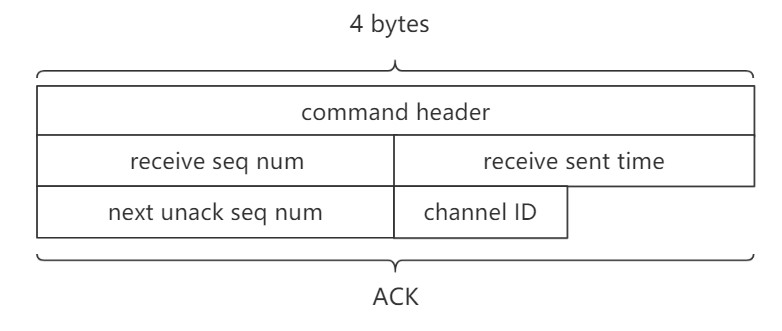

ACK指令结构如图4.6所示。ACK指令用于返回可靠指令接收的确认，当收到可靠数据包时，接收端便向发送端返回一个ACK指令。ACK指令除包含4个字节的指令头外，还包含其确认的指令的序号（receive seq num），其确认指令的发送的时间（receive sent time），接收端下一个需要接收的指令序号（next unack seq num），返回指令所在的channel序号（channel ID）。

这里需要channel ID的原因是由于网络库系统的指令和可靠数据指令发送和接收机制基本相同，唯一不同是数据指令需要对数据进行接收和排序，而网络库系统指令直接处理即可，故网络库系统指令和可靠数据发送和接收采用的是同一套流程，只是处理方式不同。所以ACK所确认的指令可能包含在多个channel中，这里需要使用channel ID标记该指令所在的channel序号，以分辨不同的指令类型。

​       返回的下一个需要接收的指令序号（next unack seq num）。表明在该序号前的所有指令都已经接收到了，即在发送端缓冲区中该序号之前的指令已经可以删除掉了。

### 4.2.4 redundancy ACK指令结构

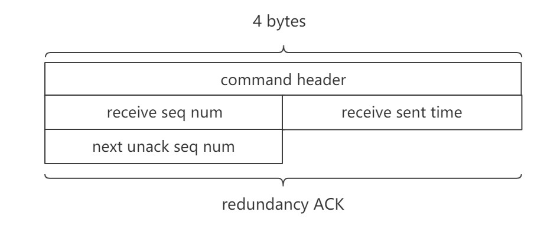redundancy ACK指令结构如图4.7所示。redundancy ACK指令用于冗余协议数据的接收确认。当收到冗余协议的数据时，便向发送端返回该ACK指令，表明接收端已经收到对应序号的指令。

与ACK不同，redundancy ACK指令只是确认冗余协议数据，故其只在一个channel中，所以不需要携带channel ID来标识其确认的指令所在channel的序号。


## 4.3 基于ARQ协议可靠数据指令传输流程


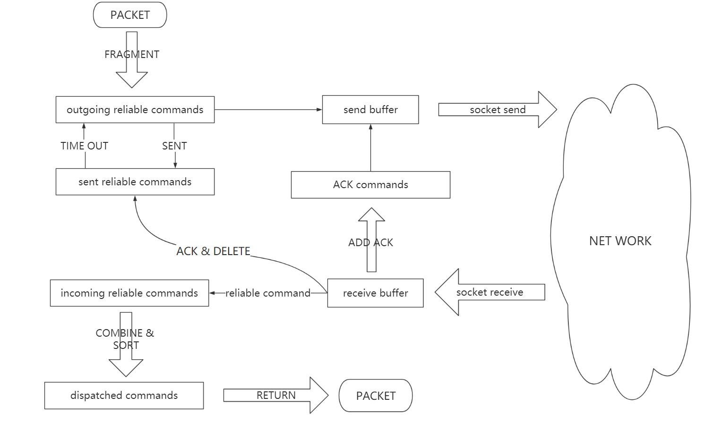

网络库基于ARQ协议可靠数据指令传输流程如图4.8所示。可靠数据指令传输基于选择重传的方法实现。

首先用户调用网路库提供的发送数据的接口，网络库会根据该数据的长度判断是否对该数据进行分片，随后将携带数据的数据指令压入outgoing commands队列中。每次发送outgoing commands队列中的数据指令后，便将该数据指令移动到sent commands队列中，在每次网络库的主循环中会对sent commands队列中的指令进行超时检测，对于等待ACK时间超过其RTO的指令，网络库会将其重新压入outgoing commands队列中进行重传，同时将其RTO变为之前的1.5倍。这里将RTO变为1.5倍而不是2倍的原因是在实际应用中发现1.5相对于2能取得更好的效果。

发送数据时，会将outgoing commands队列和ACK队列中的数据先放在一个发送缓冲区中，随后调用socket接口将该缓冲区中的数据发送出去。

在接收数据时，首先会调用socket接口将数据接收到一个接收缓冲区中，在接收缓冲区中会根据指令的类型对指令进行分类处理：

1. 如果是网络库系统指令，则直接进行相应的处理，如请求连接，带宽调控等。如果该指令要求返回ACK，则同时在ACK队列中压入对该指令序号确认的ACK指令。

2. 如果是ACK指令，则根据ACK指令携带的指令序号删除sent commands队列中的相应指令，表明该指令对端已经收到。如果在sent commands队列中没有找到该指令序号，则在outgoing commands队列中继续查找，因为该指令有可能已经准备重传。如果都没有找到，则不对其进行处理。

3. 如果收到的是数据指令，首先向ACK队列中压入一个对该数据指令序号确认的ACK指令。随后将该数据指令根据该数据指令的序号插入incoming commands队列中。如果该指令是分片的指令，则在插入过程中对该分片组进行重组。每次有新的数据指令到达incoming commands队列中后，网络库便将该队列中其序号前的所有指令已经到达的指令移动到dispatched队列中，等待返回给用户接收数据事件。

在每次收到ACK指令并从sent commands队列中删除相应的指令时，网络库会根据ACK指令中携带的sent time（发送时间）和当前网络库时间计算出该指令的RTT，并对网络库的平滑RTT进行更新。并通过平滑RTT和平滑RTT变化值对网络库的平滑RTO进行更新。在网络库可靠指令发送时会将该指令的RTO设置为网络库当前平滑RTO的值[5]。

网络库在发送数据时为保证各个PEER间的公平性，每次发送数据并不是将一个PEER中的数据全部发送完成后才发送下一个PEER的数据，而是采用轮询的方法。首先尝试将一个PEER中的数据放入send buffer中，如果加入当前数据后send buffer中的数据长度超过MTU，则暂停对当前PEER数据的添加，先调用socket接口将该数据放入一个UDP数据报中发送出去，并将HOST中的continue send标记变量置为1，意味着仍有PEER有数据要发送，接着发送下一个PEER中的数据。在每次轮询中每个PEER至多发送大小为MTU数据量，直到所有PEER中的数据发送完成。

网络库将UDP socket设置为非阻塞模式，即网络库在调用socket接口接收数据时不会被阻塞，这时如果UDP缓冲区中有数据待处理，便会返回接收到的数据及其长度，如果没有数据待处理，则返回一个数据接收异常。网络库如果在接收数据时接收到无数据接收的异常，则从接收函数中直接返回，表明所有数据已经接收完成。网络库在接收数据时至多尝试接收256次，如果尝试接收256次之后UDP缓冲区中仍有数据待接收，则暂停对UDP缓冲区中数据的接收，首先对现阶段接收到的数据进行处理。当将收到的指令处理完成，并将收到的数据返回给用户之后，再继续尝试从UDP缓冲区中读取数据[6]。

## 4.4 冗余协议数据指令传输流程

冗余协议即在发送数据时会捎带之前已经发送过但是未收到ACK确认的数据指令。冗余协议相对于TCP超时重传的方式虽然会浪费较多的带宽，但是在弱网条件下可以取得更为稳定的延时和较高的实时性。在帧同步游戏中，服务器需要转发的每帧的数据量通常较小，一般只有几十个字节，而IP层支持的最小的MTU大小也有576个字节，在发送一个UDP数据报时完全可以携带数个之前已经发送但是没有收到ACK的数据指令。

不管是冗余协议还是基于ARQ的可靠协议都要求返回给用户的数据可靠且有序，序号靠前的数据指令没有收到时，网络库不会将已经收到的序号靠后的数据指令传递给用户，即当前数据指令的实际延时不仅受当前指令在网络中传输延时的影响，同样受之前发送数据指令的传输延时影响。

冗余协议本质上相当于快速重传接收端没有收到的数据指令，虽然有些指令可能因为网络延时波动推迟收到而不是真正的丢失，但是只要在相应时间内没有收到对端返回的ACK指令，便会将发送队列中的数据重传，通过浪费部分带宽而换取稳定的延迟和较高的实时性。这种方式在帧同步游戏数据传输的场景中，尤其是弱网条件下，极其适用。

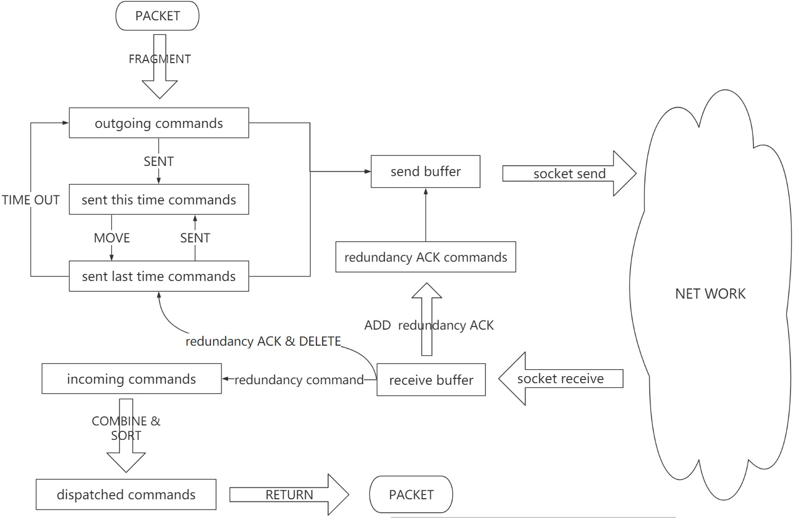


网络库冗余协议数据传输流程如图4.9所示。

与可靠数据传输流程相比，冗余协议主要在数据重传的过程中有所不同。

 在发送冗余协议数据指令前，同样需要判断数据是否需要分片，并将需要传输的数据指令放入outgoing commands队列中。冗余协议的用于存放已经发送数据的队列有两个：sent this time commands和sent last time commands。网络库在发送数据时，不仅会将outgoing commands队列中的数据放入send buffer中，而且会将sent last time commands队列中存在时间超过该PEER平滑RTT的数据指令同样放入sent buffer中发送出去。在判断sent last time commands队列中的数据是否有数据需要重传时满足的条件有：

1. sent last time commands队列中有数据指令存在。

2. 距离上次重传sent last time commands中数据的时间间隔是否超过该PEER的平滑RTT减去该PEER的平滑RTT波动值。

3. 或者在接收到该PEER返回的ACK指令后还没有向该PEER发送过数据。

在满足条件①的情况下，当符合条件②或③时，便会重传sent last time commands队列中超时的数据指令。条件②即表明sent last time commands队列中存在数据在该队列中的时间超过该PEER的平滑RTT的下限。条件③说明已经收到对端返回的接收确认指令，但是sent last time commands队列中仍有数据未被确认，即该数据指令有可能已经在网络传输过程中丢失。在重传sent last time commands队列中的数据指令时，需要判断数据指令在该队列中的存放时间，如果存放时间小于一定数值（根据PEER的平滑RTT计算得出），则不会重传该数据指令。

冗余协议在发送完outgoing commands队列中的数据和sent last time commands队列中需要发送的数据后，会将这些数据指令移动到sent this time commands队列下，即在本次发送数据过程中发送的数据指令会被移动到sent this time commands队列中。当本轮数据发送完成后，会将sent this time commands队列中的数据重新移动到sent last time commands队列中。

这里需要两个队列存放已经发送数据指令的原因是网络库为了保证公平性，并不会一次将该PEER需要发送的数据发送完。如果需要继续发送数据并只用一个队列的话，在第二次发送时需要将所有数据指令再次遍历一遍计算出发送的时间间隔才能确定是否需要发送该数据指令，进而降低网络库的效率和性能。

接收数据的流程同可靠协议基本相同，当收到ACK时会删除掉sent last time commands队列中相应的数据指令，如果在该队列中找不到对应的序号，则会在outgoing commands队列中继续查找，如果均没找到，则不做处理。

如果收到数据指令，则向发送端返回相应序号的ACK指令，并将收到的数据指令按照指令序号插入到incoming commands队列中，并在插入过程中对分片的指令进行重组。并将incoming commands队列中的有序到达的数据指令移动到dispatched commands队列中，等待将该数据指令传递给用户。

​       冗余协议同样会对发送的数据包进行超时检测，即当sent last time commands队列中有数据超过该指令的RTO时间仍没有收到ACK时，便会将该指令压入outgoing commands队列中进行重传。每次重传冗余数据指令时其RTO增量设置为该PEER平滑RTO的一半。如果一个冗余数据指令的重传次数超过其重传次数上限，则认为该PEER已经断开连接，则进入断开连接流程。

## 4.5 无序数据指令传输流程

无序数据指令即不要求排序也不可靠的数据指令，相当于直接将用户传入的数据通过UDP数据报发送出去，但仍会根据用户传入数据的大小进行分片操作。无序数据指令传输流程如图所示：

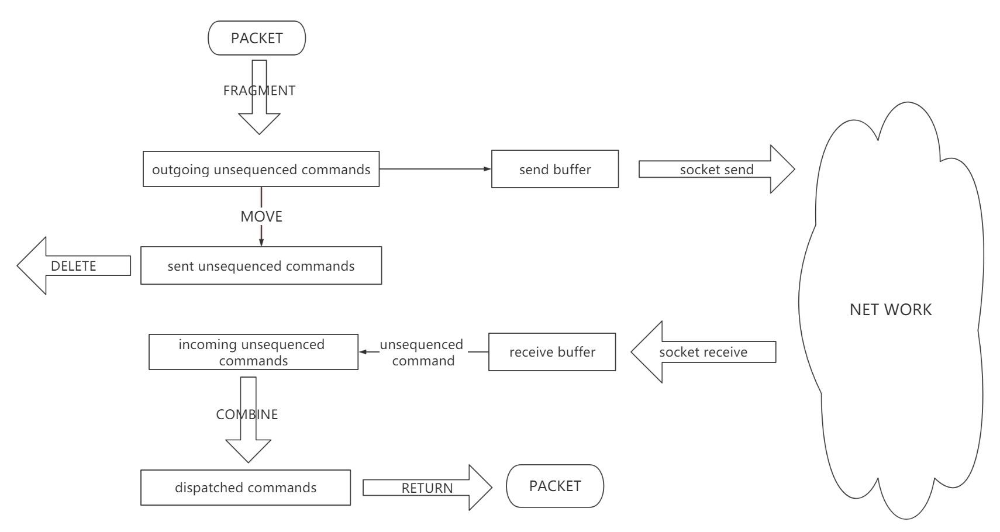

因为该数据指令不要求可靠，所以网络库在收到数据指令后不需要返回ACK指令，同时sent unsequenced commands在send buffer中的数据调用socket发送数据接口发送出去后，不必等待ACK指令便可直接删除。这里需要等待数据发送出去的原因是，send buffer中的储存的并不是真正需要发送的数据，而是一个指向需要发送数据的指针以及相应数据的长度的数组，待发送的数据仍在各个队列的指令中存储。无论是windows提供的WSASendTo函数还是unix上的sendmsg函数，均可以直接将send buffer中的数组及其需要发送buffer的个数传递给这些接口直接发送，这样比起直接将数据copy到一个buffer中再调用socket接口发送，可以减少数据再内存中的copy次数，提高网络库效率。所以在数据发送完成后，才将sent unsequenced commands队列中的数据指令清除。

由于不要求有序且不可靠，对于单个的数据指令并不需要对其进行编号，在接收端收到的数据指令时直接移动到dispatched commands队列中等待返回给用户即可，也不需要进行排序操作。对于分片的无序数据指令，需要对每个分片进行编号，并在接收端进行重组。如果在接收端序号较小的分片组还没有重组完成，而序号较大的分片组中的数据指令已经到达，则直接丢弃序号较小的分片组的数据包。当分片组中的各个数据指令重组完成后，便将合并后的数据指令移动到dispatched commands队列中等待返回给用户。

# 5 流量控制

网络库流量控制的实现，同TCP类似，也是由控制一个发送窗口的大小来实现流量控制。由于网络库是多连接，根据不同PEER设置情况，每个PEER的发送窗口大小都不相同，但是都保证网络库向该PEER发送数据时正在传输的数据量的大小不超过其发送窗口的大小，进而控制向该PEER传输数据的速率。发送窗口的实际大小会根据当前网络的状况（丢包或者延迟波动）进行变化。

网络库可以选择打开或者关闭带宽控制，网络库在创建HOST时，会让用户设置该HOST上行和下载的带宽，如果用户将该值设置为0，则意味着关闭流量控制。网络库在建立连接时，会将两端HOST的设置的带宽在三次握手的过程中同步给对端，对端在接收到之后会取对方的下载带宽和本地的上传带宽计算出一个该PEER发送窗口大小的上限，后续在与该PEER进行通信的过程中会根据网络的实际状况通过该发送窗口大小的上限计算实际发送窗口的大小。

网络库对发送窗口大小的调控通过一个流量控制阀门（packet throttle）实现。packet throttle的大小会根据网络库所在网络的实际状况和HOST对各个PEER的带宽分配决定。对于可靠数据包的发送，网络库会通过packet throttle的值对该PEER的实际发送窗口大小进行调控，确保向该PEER传输中数据量不会超过该窗口大小。对于不可靠数据包的发送，会根据packet throttle的值计算出一个数值来对不可靠数据包进行概率性丢弃。

## 5.1 通过带宽设置流量控制阀门上限

因为网络库是多对多的连接，所以如果HOST设置了上行或下载带宽的大小，在分配HOST带宽时要考虑到各个PEER间带宽分配的公平性问题，即在满足公平性的前提下尽可能多的利用HOST的带宽。

### 5.1.1 调节HOST的发送数据能力

调节HOST发送数据能力时，会根据HOST的上传带宽，PEER下载带宽和在最近时间内实际向PEER发送数据量的大小对packet throttle limit进行设置。packet throttle limit限定了packet throttle，也就是流量控制阀门的最大值，即packet throttle在后续调节过程中大小不会超过该值。在这个过程中会根据如果该PEER将带宽设置为0，则意味着该PEER关闭流量控制，在进行packet throttle limit设置时会忽略该PEER。

首先统计出在上次流量控制间隔时间内HOST向各个PEER发送的总的数据量：

```c
bandwidth = HOST->outgoingBandwidth * elapsedTime;
for (connected PEER in HOST) {
    dataTotal += PEER->outgoingDataTotal;
}
```

bandwidth即通过HOST上传带宽得出的在间隔时间内的host数据发送能力，dataTotal即在间隔时间内HOST向PEER发送的数据的总量。

接下来根据PEER的下载带宽限制以及HOST在时间间隔内向PEER发送的数据量调节HOST向该PEER发送数据时的packet throttle limit的值。

```c
While ( peers remaining and ! needsAdjustment ) {
	
	if(dataTotal <= bandwidth)
		throttle = THROTTLE_MAX;
	else 
		throttle = (bandwidth * THROTTLE_MAX) / dataTotal;

	for(connected PEER in HOST) {
		if(PEER don’t open bandwidth adjust or has adjusted just now)
			continue;
		peerBandwidth = peer->incomingBandwidth * elapsedTime;
		if((throttle * peer->outgoingDataTotal) / THROTTLE_MAX <= peerBandwidth)
			continue;
		
		peer->packetThrottleLimit = (peerBandwidth * THROTTLE_MAX) / peer->outgoingDataToal;

		bandwidth -= peerBandwidth;
		dataTotal -= peerOutgoingDataTotal;
	}
}

if(peers remaining) {
	if(dataTotal <= bandwidth)
		throttle = THROTTLE_MAX;
	else throttle = (bandwidth * THROTTLE_MAX) / dataTotal;

	for(connected PEER in HOST) {
		if(PEER don’t open bandwidth limit or has adjusted just now)
			continue;
		peer->packetThrotleLimit = throttle;
	}
}
```

这个过程总结来说就是在HOST上行带宽允许的条件下尽可能将PEER的packet throttle limit设置为其下载带宽能承载的上限，保证在不超过host的发送能力和PEER的接收能力的情况下，尽可能多的利用双方的带宽。

throttle可以理解为HOST所能承载的发送的流量阀门，在以throttle为流量控制阀门进行发送时，不会超过HOST的发送能力。在这个过程中，如果发送能力超过了PEER所能下载带宽所能承载的能力，便将该PEER的packet throttle limit设置为该值，并将该PEER的值从HOST总的带宽和流量中减去，进行下一轮循环。由于在每次循环会将接收能力较小的PEER设置完成，所以在下次循环中HOST为剩余的PEER分配的带宽会不断增多，即在HOST上行带宽允许的条件下尽可能多的分配。这里为什么不直接将PEER的packet throttle limit设置为其带宽上限的原因是因为HOST的发送能力有可能不足以承载每个PEER下载带宽的上限。

剩余的PEER的接受能力均大于HOST的发送能力，则直接将HOST带宽平均分配到每个PEER中，即剩余的PEER的packet throttle limit均设置为throttle。

### 5.1.2 调节PEER发送数据的能力

同样的PEER也会向HOST发送数据，同样保证PEER发送数据的速度不会超过HOST的下载的带宽。由于不能直接对PEER端的参数进行设置，所以需要向PEER发送带宽控制指令进行调节。

```c
bandwidth = HOST->incomingBandwidth;

if(bandwidth is zero)
	bandwidthLimit = 0;
else while(peers remaining and needsAdjustment) {

	bandwidthLimit = bandwidth / peersRemaining;
	for(PEER in HOST) {

		if(PEER->throttleEpoth == now) continue;
		if(PEER->outgoingBandwidth >= bandwidthLimit)
			continue;
		PEER->throttleEpoth = now;

		bandwidth -= PEER->outgoingBandwidth;
	}
}

for(PEER in HOST) {
	bandwidthLimitCommand.outgoingBandwidth = HOST->outgoingBandwidth;
	if(peer->throttleEpoth == now)
		bandwidthLimitCommand.incomingBandwidth = PEER->outgoingBandwidth;
	else 
		bandwidthLimitCommand.incomingBandwidth = bandwidthLimit;
	
	send_command_to_peer();
}
```

这里调节的过程同调节HOST发送数据的过程类似，即如何将HOST的下载的带宽在不超过PEER发送的能力的情况下平均分给每个PEER，并且又能够充分利用HOST的带宽。

在循环中每次将发送能力小于HOST接收能力的PEER用PEER->throttleEpoth（流量控制时间戳）标记出来，表明HOST足以能承载该PEER的全带宽，在发送带宽控制命令时将命令的下载带宽（incomingBandwidth）直接设置为该PEER的上传带宽（outgoingBandwidth）。对于剩余的PEER，其发送能力要大于HOST的接收水平，则将带宽控制命令的incomgingBandwidth设置为HOST的剩余接收带宽的均值，防止PEER发送数据的速率超过HOST的接收能力。

这里使用双层循环而不是直接将其设置为均值的原因是，优先分配带宽较小的PEER的设置可以更充分的利用HOST的带宽。每次分配发送能力较差的PEER后，便可以将剩余的带宽更多的分配到发送能力较强的PEER中。

## 5.2 通过指令往返时间设置流量控制阀门

### 5.2.1 更新网络库平滑RTT

网络库在收到对端返回的ACK指令或者redundancy ACK指令时，会根据ACK指令中携带的数据指令的发送时间计算出本次数据指令的RTT。在计算出本次数据指令传输的RTT后，网络库会根据当前指令的RTT更新该PEER的平滑RTT和平滑RTT变化值[7]，具体更新方法如下：

```c
RTT_VAR = RTT – PEER->RTT
PEER->RTT = RTT + RTT_VAR / 8
PEER->RTT_VAR = PEER->RTT_VAR * 3/4 + RTT_VAR / 4

if(PEER->RTT < PEER->lowest_RTT)
	PEER->lowest_RTT = peer->RTT
if(PEER->RTT_VAR < PEER->highest_RTT_VAR)
	PEER->highest_RTT_VAR = peer->RTT_VAR
```

PEER->RTT和PEER->RTT_VAR是该PEER记录的平滑RTT值和平滑RTT变化值。RTT是根据本次ACK指令得到往返时间，RTT_VAR是本次的RTT值减去PEER的平滑RTT值得到。同时PEER内部会记录在当前RTT运算周期内的平滑RTT的最小值(PEER->lowest_RTT)和平滑RTT变化的最大值(PEER->highest_RTT_VAR)。

每隔一段时间，网络库会将平滑RTT的最小值和平滑RTT变化的最大值重新设置为网路库当前的平滑RTT和平滑RTT变化值，并用PEER->last_RTT和 PEER->last_RTT_VAR记录这两个值。

```c
PEER->last_RTT = PEER->lowest_RTT
PEER->last_RTT_VAR = PEER->highest_RTT_VAR
PEER->lowest_RTT = PEER->RTT
PEER->highest_RTT_VAR = PEER->RTT_VAR
```

### 5.2.2 更新网络库流量控制阀门

根据PEER记录和更新的往返时间的变化更新流量控制阀门（packet throttle）。

```c
if (PEER->last_RTT <=  PEER->last_RTT_VAR) {
    PEER -> packet_throttle = PEER->packet_throttle_limit;
}
else if (RTT < PEER->last_RTT) {
    PEER->packet_throttle += PEER->packetThrottleAcceleration;

    if (PEER->packet_throttle > PEER->packet_throttle_limit)
        PEER->packet_throttle = PEER -> packet_throttle_limit;
}
else if (RTT > PEER->last_RTT + 2 * PEER->last_RTT_VAR) {
    if (PEER->packet_throttle > PEER->packet_throttle_deceleration)
        PEER->packet_throttle -= PEER->packet_throttle_deceleration;
    else
        PEER->packet_throttle = 0;
}
```

其中对流量控制阀门操作的三个步骤有：

1. 如果上个周期内该PEER的平滑RTT最小值小于等于该PEER上个周期内平滑RTT变化值的最大值的话，则直接将流量控制阀门(packet throttle)设置为该PEER中流量控制阀门的上限值(packet throttle limit)。这种情况适用于在上个周期内网络库的RTT减小很快，当前平滑RTT至少为上个周期平滑RTT的一半或者网络库初始化时上个周期内平滑RTT最小值和平滑RTT变化最大值都为0的情况。

2. 如果当前指令的RTT小于上个周期内平滑RTT的最小值，则相应增加网络库的流量控制阀门，但不会超过其上限。

3. 如果当前指令的RTT值大于上个周期内平滑RTT的最小值加上2倍RTT变化的最大值，则说明当前网络拥塞状况较差，则相应减少网络库的流量控制阀门。

数据包的往返时间在一定程度上反映了网络的拥塞状况，通过发送数据包往返延时的变化调节网络库的流量控制阀门，进而调节网络库发送窗口的大小，进而调节发送数据的带宽以适应网络的变化[8]。

# 6 测试及成果展示

## 6.1 测试目标

测试网络库在不同丢包率和不同延时的网络状况下发送数据包的延时情况，验证通过冗余协议发送数据是否可以在弱网环境下相比于超时重传协议取得更高的实时性，并与ENet、KCP等网络协议性能进行对比测试，给出对比结果。

## 6.2 测试方案

为了方便设置不同的网络延时和丢包率，模拟真实网络环境，测试将使用丢包模拟器设置本机网卡的上行下载的延时和丢包率，并在内网环境下进行。

由于只有一台电脑和一台路由器，但通过修改本地路由表，让发向本地IP地址的数据包首先发送向网关，再由网关返回回来，并通过丢包模拟软件设置本机网卡上行下载的带宽和丢包率，这样每次经过本机网卡便会存在丢包和延时，便可以模拟真实的网络情况，进而进行测试。

测试通过客户端不断向服务端发送数据，数据包内会携带发送数据包时的客户端的本地时间，服务器收到数据包后立马向客户端返回该数据包，客户端收到数据包后解析该数据包中包含的时间，并用当前客户端时间减去该值得到该数据包通过网络库传输的延时。最终获得传输数据时的平均延时和延时波动图像。

> 测试主机型号

| 系统型号 | XPS 15 9560                                        |
| -------- | -------------------------------------------------- |
| 操作系统 | Windows 10 16299                                   |
| 处理器   | Intel(R) Core(TM) i7-7700HQ   CPU @ 2.8Hz          |
| 网卡     | ASIX AX88179 USB 3.0 to   Gigabit Ethernet Adapter |

>  测试路由器型号

| 系统型号 | MIR3  |
| -------- | ----- |
| 传输速率 | 1200M |

本地丢包和延时模拟软件：Network Emulator for Windows Toolkit

本地测试环境如图所示：

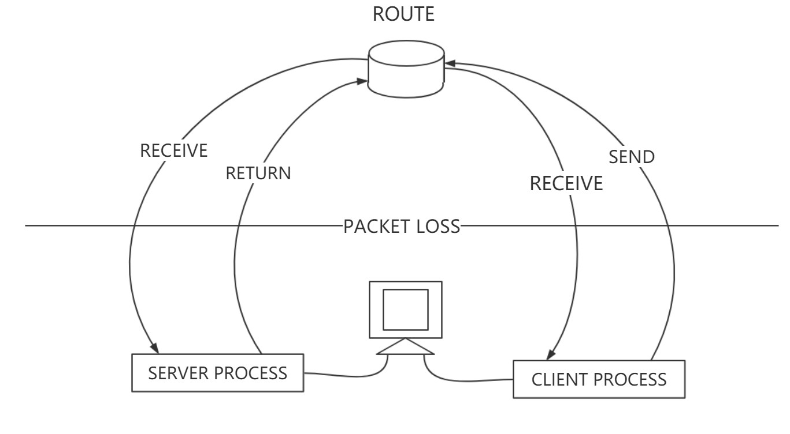

测试时会在本地创建两个进程分别用作客户端和服务端。测试时客户端进程会向服务端进程发送数据包，更改路由表后，发向本地IP地址的数据包会首先发送向网关，再由网关转发给服务端进程。同样服务端进程再收到数据包后也先发送向网关，再由网关返回给客户端。

## 6.3 性能测试与分析

测试时会比较本项目网络库两种数据发送方式：基于ARQ协议的可靠数据发送和基于冗余协议的可靠数据的发送， ENet网络库的数据发送以及KCP协议的数据发送在不同网络延时和丢包率下的平均延时和发送数据量的对比，并比较其传输时的数据包延时的波动图像。

在测试时，为保证公平性，会将网卡的上行和下载丢包率以及上行和下载的延时设置为相同的值。根据图6.1可以发现从客户端发送到接收服务器返回的数据包，数据包实际会经过网卡4次，也就是实际中总的延时和丢包率其实是网卡设置值的4倍。

### 6.3.1 协议平均延时和带宽占用测试

#### 6.3.1.1 低延时网络环境下协议测试

> 本地测试网络环境和发包设置

| 上传平均延时   | 5ms            | 下载平均延时       | 5ms            |
| -------------- | -------------- | ------------------ | -------------- |
| 上传延时范围   | **0ms ~ 10ms** | **下载延时范围**   | **0ms~10ms**   |
| 往返平均延时   | **20ms**       | **往返延时范围**   | **0ms ~ 40ms** |
| 单个数据包大小 | **80bytes**    | **发送数据包个数** | **1000**       |
| 需要发送总数据 | **80kb**       | **发送数据包间隔** | **30ms**       |

> 平均延时和发送数据量测试结果


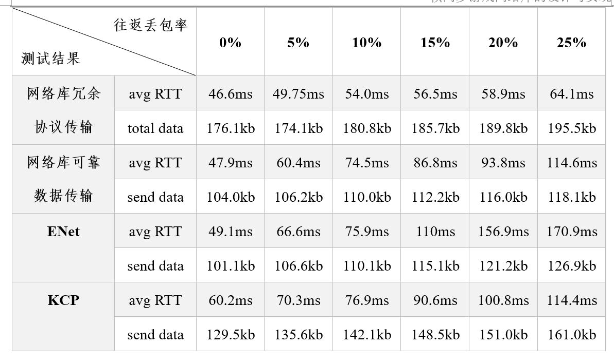

端进程向服务器进程每隔30ms发送80字节的数据包，测试其平均延时和网络库实际调用socket 接口发送的数据量，各个协议在不同丢包率下的平均延时和网络库发送数据总量如图所示。

> 网络库发送数据包平均延时

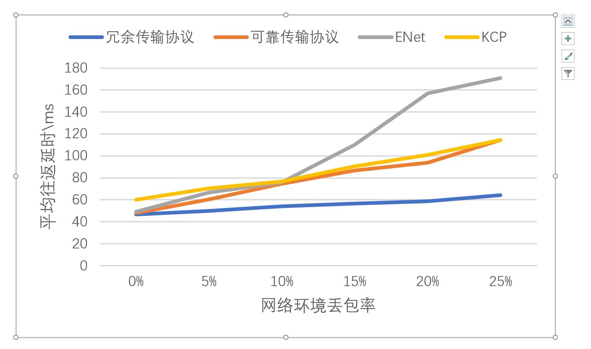

> 网络库发送数据包总量

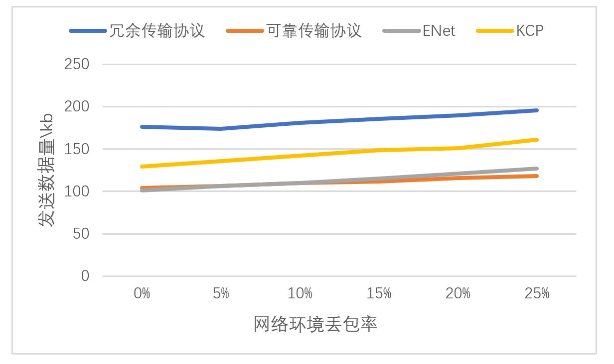

#### 6.3.1.3 高延时网络环境下协议测试

> 本地测试网络环境和发包设置

| 上传平均延时   | 20ms            | 下载平均延时       | 20ms             |
| -------------- | --------------- | ------------------ | ---------------- |
| 上传延时范围   | **10ms ~ 30ms** | **下载延时范围**   | **10ms~30ms**    |
| 往返平均延时   | **80ms**        | **往返延时范围**   | **40ms ~ 120ms** |
| 单个数据包大小 | **80bytes**     | **发送数据包个数** | **1000**         |
| 需要发送总数据 | **80kb**        | **发送数据包间隔** | **30ms**         |

> 平均延时和发送数据量测试结果


这里设置本机网卡上传下载的平均延时为20ms，波动范围为10ms，发送数据包往返延时范围为40ms~120ms。客户端进程向服务器进程每隔30ms发送80字节的数据包，测试其平均延时和网络库实际调用socket 接口发送的数据量，各个协议在不同丢包率下的平均延时和网络库发送数据总量如图所示。

> 网络库发送数据包平均延时

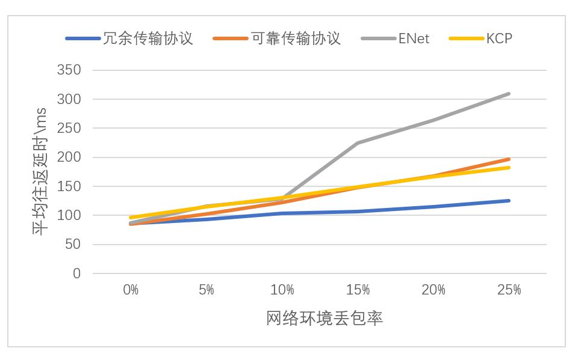

> 网络库发送数据包总量

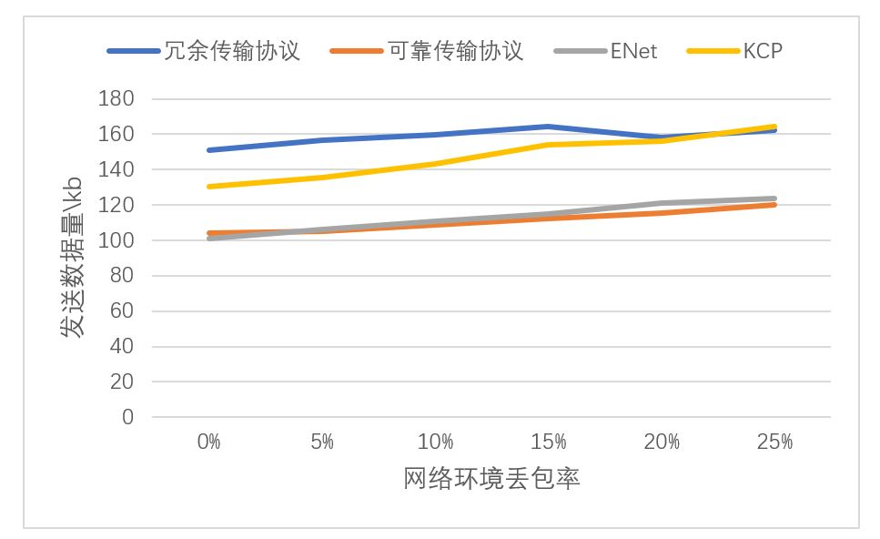

### 6.3.2 不同网络协议延时波动图像对比

接下来将协议传输1000个数据包中的每个数据包的延时在图像中绘制出来，通过数据包延时波动的对比，可以对每个数据包的实时性有更为直观的判断。

> 本地测试网络环境和发包设置

| 上传平均延时   | 10ms           | 下载平均延时       | 10ms           |
| -------------- | -------------- | ------------------ | -------------- |
| 上传延时范围   | **0ms ~ 20ms** | **下载延时范围**   | **0ms~20ms**   |
| 往返平均延时   | **40ms**       | **往返延时范围**   | **0ms ~ 80ms** |
| 上传丢包率     | **5%**         | **下载丢包率**     | **5%**         |
| 往返丢包率     | **20%**        |                    |                |
| 单个数据包大小 | **80bytes**    | **发送数据包个数** | **1000**       |
| 需要发送总数据 | **80kb**       | **发送数据包间隔** | **30ms**       |

> 网络库冗余协议数据包延时图像

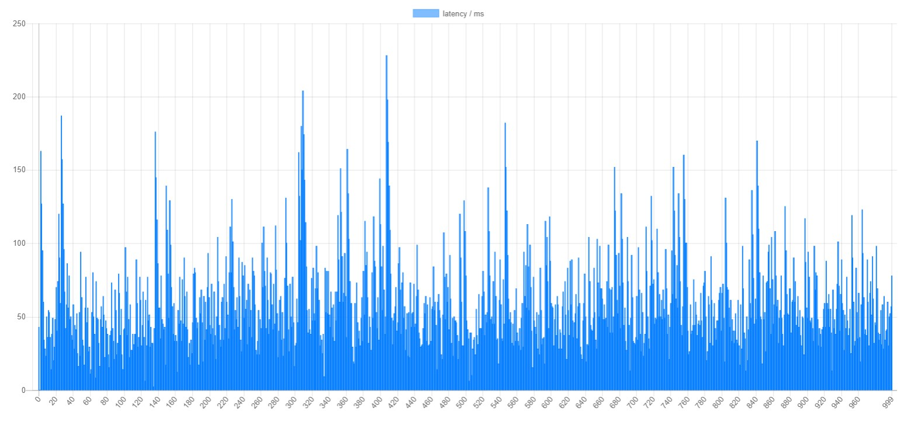


> 网络库可靠协议延时波动图像

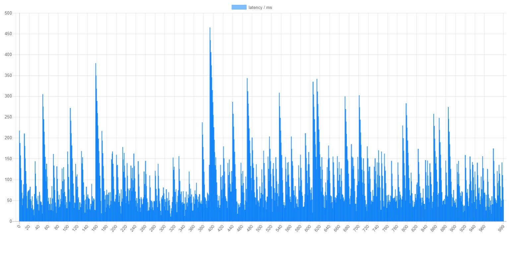

> KCP延时波动图像

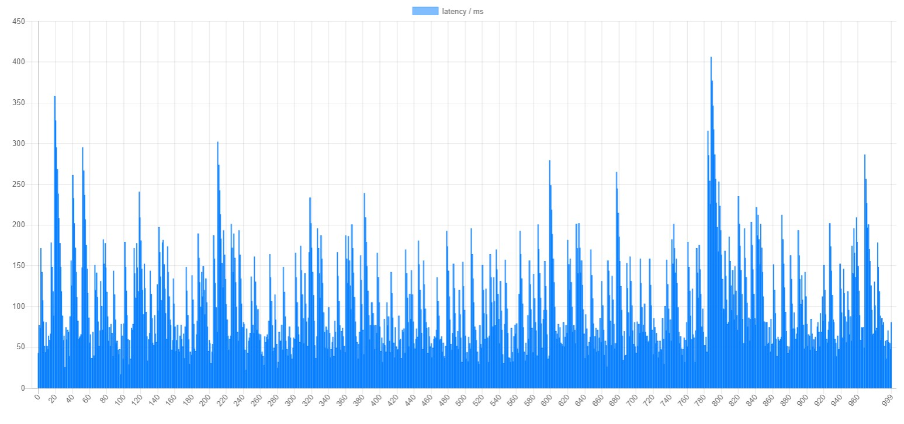

> ENet延时波动图像

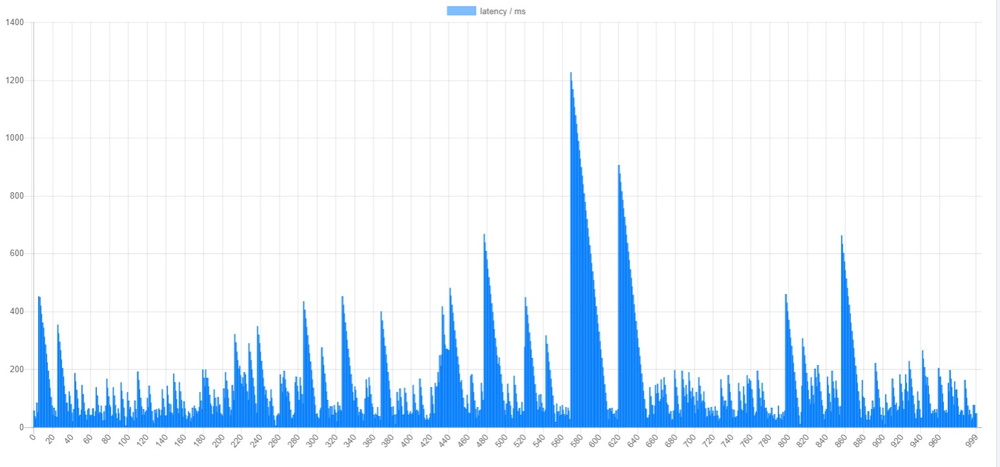

以上图像是通过将每个数据包的延时放在柱状图中绘制出来得到的波动图像，每个图中的纵坐标的范围均不相同（延时的峰值不同），横坐标则是发送数据包的序号：1~1000，根据图像可以直观的看出网络协议在发送数据时的延时波动状况。

### 6.3.3 测试结果分析

#### 6.3.3.1 网络库可靠协议和ENet

该帧同步网络库的可靠数据协议和ENet网络库均采用的超时重传的方式，所以二者从测试情况中来看，存在较多的共性。唯一不同的是，本项目的可靠数据协议在重传数据包时RTO每次增大为原来的1.5倍，而ENet在重传时则是将数据包的RTO变为之前的2倍[9]。

从图6.2、图6.2和图6.6中可以看出，采用超时重传方式的可靠协议在发送数据时其数据包的平均延时会随着丢包率的增大出现较大的变化，并且ENet随着丢包率的增大，其平均延时变化接近指数增长。

而本项目网络库的可靠数据协议RTO增长设置为1.5倍，可以看出在丢包率较大时，其对带宽的占用量和ENet相比几乎相差无几，但是其平均延时在丢包率较大时相比于ENet却可以得到较大的提升。实践证明，RTO 1.5倍增长在该测试情形中相比于2倍正常可以取得更加优异的效果。

从图6.9和图6.11中可以发现采用超时重传的网络协议，无论是网络库的可靠协议，还是ENet，其在丢包时，数据包的延时会出现明显的峰值，这种峰值可以当作网络中的抖动。这种抖动对于网络实时性要求较高的应用，尤其是对游戏来说，会造成较差的用户体验，用户会明显的感觉到出现卡顿的情况。由于网络库中的可靠协议和ENet首先考虑的是对带宽的充分利用，所以其在处理这种抖动时较为无力，会出现局部数据包的延时较大的情况。这种情况在弱网环境下，尤其是丢包率较大的环境中表现尤为明显。

相比于冗余协议，基于超时重传的可靠协议带宽占用要低很多，即使在丢包率较高的网络环境下，其对带宽的占用也只是缓慢的增长，所以在网络状况较好，无丢包的情况下可以作为优先选择。

#### 6.3.3.2 网络库冗余协议

从平均延时的测试中（图6.2、图6.4和图6.6）可以看出冗余协议在不同网络延时环境下均可以取得较低的平均延时，并且随着网络环境丢包率的增大，其发送数据包的平均延时并不会快速增长，而是随着丢包率的增大缓慢的线性增长。在丢包率较大时，基于超时重传协议的网络库（ENet，KCP）的延时和无丢包时的网络延时相比，已经达到非常高的数值，但是冗余协议此时依然具有非常高的实时性。可以看出冗余协议具有较强的鲁棒性，即使在网络环境非常差的情况下（丢包率达到25%）依然可以取得稳定的延时。

从图6.8中可以看出冗余协议在处理延时的抖动时，无论是峰值出现的数量，峰值的高度，还是持续时间（山峰形状的宽度）都有明显的提升，可以看出冗余协议提升的不仅是网络库整体数据发送的平均延时，对于单个数据包延时以及抖动出现的次数和频率、抖动的峰值也均有明显的提升，大大增强了整体数据传输的实时性和流畅性。

但是由于冗余协议算法是利用带宽换取实时性，相比于比于其他的协议算法和网络库，其对带宽的占用较多。平且随着丢包率的增大，其发送实际发送的数据量也会缓慢升高。

#### 6.3.3.3 KCP协议

KCP协议相比于以上两种协议，无论是平均延时还是带宽的占用都处于中间水平，即相比于冗余协议，其数据包平均延时会大于冗余协议，实时性相比较差，但是其对带宽的占用相比于冗余协议更优。而相比于ENet，其会占用更多的带宽，但是在丢包率较高的网络情况下又可以取得更好的实时性。

KCP虽然也采用的是超时重传的方式，但其之所以会浪费更多的带宽，是因为其数据包RTO的增长并不是指数型的，而是线性的[10]。相比于ENet这种指数正常的重传方式，其在存在丢包时重传会更为快速，但是由于RTO线性增长，其对带宽的占用也会相对较多。

同样由于其RTO的线性增长策略，从图6.10中可以看出，KCP在处理抖动时，数据包的延时相比于网络库的可靠协议和ENet更加稳定，但是相比于冗余协议仍有较大差距。

#### 6.3.3.4 结论

通过以上两种数据对比可以看出，在丢包率和网络延时波动较大的网络情况下，冗余协议是最优的选择。其可以极大的提升网络库数据传输的流畅性和实时性。

对于丢包率较低或者基本无丢包的网络环境，例如有线网络，可以采用ENet或者网络库提供的可靠协议，此时几种网络协议的实时性相差无几，但ENet和网络库的可靠协议对于带宽的占用更少。

对于偶尔出现丢包情况的网络网络，可以选择KCP协议，其在单个延时的抖动处理会优于ENet和网络库的可靠协议，但是又不会像冗余协议占用过多的带宽。

# 总结和展望

本项目实现了一个网路库，其封装了三种数据发送方式：冗余协议，基于ARQ的可靠协议和无序数据包的发送。并且实现了连接管理和流量控制，可以在linux系统和windows系统等多种系统下使用。经过测试发现冗余协议在弱网环境下可以极大的提升网络库的流畅性和实时性，可以有效降低网络抖动和延时对应用的影响。

## 7.1 帧同步游戏网络库展望

虽然网络库预期功能都已实现，并在测试中取得了较好效果，但是依然存在着诸多可以提升的空间。

### 7.1.1多线程的调用

由于网络库中各个队列的操作并不是原子性的，所以网络库暂时并不支持多线程的调用，除非在每个线程中分别建立一个客户端。所以在实际调用中，网络库的收发数据需要在一个线程中进行，而用户要进行多线程操作时还需要线程间通信，增大网络库的使用难度。

关于网路库多线程的扩展可以参考libevent网络框架，对发送和接收都需要用到的数据队列加锁，可以实现数据包的发送和接收流程可以分别在两个线程中进行[11]。

### 7.1.2 冗余协议带宽占用优化

虽然冗余协议在测试中对网络库数据包的实时性有明显的提升，但是其带宽占用相对于可靠重传的方式依然处于较高的水平，在丢包率较高的情况下，其实际发送的数据量超过了需要发送数据量的两倍。

后续的改进可以通过优化协议的制定方面着手，例如合并数据包的发送，将数ACK指令合并在一个数据包中，或者优化对数据重传的判断，减少对于多余数据包的发送。

### 7.1.3 网络库对发送协议智能选择

网络库中封装了两种可靠协议：基于AQR的可靠协议和冗余协议，并且两种协议在不同的网络环境下取得了不同的性能，但是对于协议的选择需要用户在发送数据时指定。

后续的扩展可以可考虑给网络库添加学习的机制，在发送数据时在其内部对当前所处网络环境的延时和丢包状况进行统计和判断，并通过训练让其自行选择最优的发送数据的方式，而不需要用户来指定数据包的发送方式。


